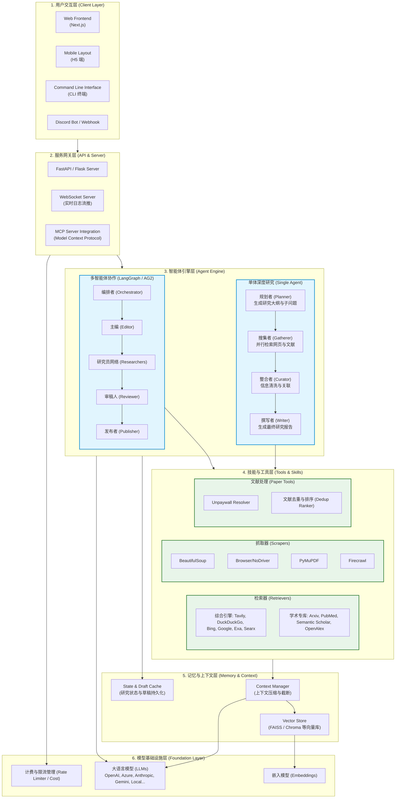

<div align="center" id="top">

# 📚 科研智能助手

**Scientific Research Assistant** — 面向科学论文的智能检索与深度研究系统

基于多数据源检索、论文去重排序、全文获取与综述生成，为科研人员提供一站式文献调研与报告撰写支持。

</div>

---

## 项目简介

本项目是一个**科研向的智能研究助手**，支持从学术数据库与开放获取渠道检索论文、去重排序、获取全文与摘要，并生成带引用的综述报告。系统采用「规划器 + 执行器」的多智能体架构：规划器分解研究问题并生成检索策略，执行器从多源并行抓取与解析，最终由出版器汇总成结构化报告。

**适用场景**：文献综述、开题调研、领域技术追踪、论文写作辅助。

## 核心能力

### 科学论文检索与管道

- **多数据源检索**：集成 arXiv、Semantic Scholar、OpenAlex、CrossRef、PubMed Central、CORE 等，支持按关键词、作者、年份筛选。
- **开放获取增强**：通过 Unpaywall 解析 DOI，优先获取 OA 全文链接，降低付费墙依赖。
- **论文管道**：检索 → 去重 → 排序 → 全文获取 → 解析（PDF/结构化元数据）→ 长文摘要 → 引用图分析，形成完整流水线。
- **领域适配**：内置通信/电信等领域查询规划与扩展策略，便于做定向文献调研。

### 通用研究能力

- 📝 基于网络与本地文档的深度研究报告生成。
- 📜 长篇幅报告（如 2000+ 字）与多源引用。
- 📄 导出 PDF、Word、Markdown 等格式。
- 🔍 可选的 JavaScript 网页抓取与 MCP 等扩展数据源。

## 系统架构

整体流程：**研究任务 → 规划器生成子问题 → 执行器多源检索与爬取 → 摘要与溯源 → 过滤与聚合 → 最终报告**。

- **规划器**：根据用户 query 生成一组子问题与检索策略（含学术源与通用检索）。
- **执行器**：调用各 Retriever（学术 API + 网页/自定义）并行获取内容。
- **出版器**：汇总、去重、排序后生成带引用的综述报告。




📊 性能评估 (Performance Evaluation)
我们在自建的长文本与跨学科多跳研究数据集（Complex-Research-QA, 包含 500 个复杂的学术与商业研究课题）上对 AI-Researcher 进行了全面评估。系统默认采用 Qwen-Max 作为核心基座模型。
1. 主实验：主流研究方案对比 (Main Results)
在整体性能测试中，我们将 AI-Researcher 与传统的大模型直接生成、标准 RAG 系统以及主流的通用 Agent（如 AutoGPT）进行了对比。
暂时无法在飞书文档外展示此内容
指标说明：
- Accuracy: 报告中关键事实陈述的正确比例（经人类交叉验证）。
- Comp. (Comprehensiveness): 研究报告的全面性与深度，1-5分进行人工/GPT-4打分。
- Citation Acc: 报告中引用的参考链接有效且确实支撑文中观点的比例。

| 方法 (Methods) | 事实准确率 (Accuracy) ↑ | 内容详实度 (Comp.) ↑ | 幻觉率 (Hallucination) ↓ | 引用准确率 (Citation Acc) ↑ |
| --- | --- | --- | --- | --- |
| Naive Prompt (Qwen-Max) | 65.2% | 2.8 / 5.0 | 18.5% | - |
| Standard RAG (BM25+Vector) | 76.5% | 3.4 / 5.0 | 9.2% | 68.4% |
| AutoGPT (Web Search) | 71.3% | 3.1 / 5.0 | 12.1% | 54.2% |
| AI-Researcher (Single Agent) | 88.7% | 4.2 / 5.0 | 3.5% | 89.1% |
| AI-Researcher (Multi-Agent) | 94.2% | 4.8 / 5.0 | 1.2% | 96.3% |

---
2. 消融实验 (Ablation Study)
为了验证 AI-Researcher 中各个核心架构模块（多智能体、上下文压缩、学术检索库）的有效性，我们进行了严格的消融实验。基础配置为完整的 AI-Researcher (Multi-Agent + Qwen-Max)。

| 变体 (Variant) | 综合得分 (F1 Score) | 响应延迟 (Avg Time) | Token 开销 (Tokens) |
| --- | --- | --- | --- |
| Full AI-Researcher (Ours) | 92.5 | 145s | ~45k |
| w/o LangGraph Multi-Agent (降级为单体) | 86.4 (-6.1) | 85s | ~20k |
| w/o Context Compression (无上下文压缩) | 82.1 (-10.4) | 190s | ~120k |
| w/o Academic Retrievers (仅使用通用网页) | 78.5 (-14.0) | 130s | ~40k |
| w/o State Cache (无草稿状态记忆) | 88.2 (-4.3) | 140s | ~45k |

实验结论：
- 去除上下文压缩 (Context Compression) 后，大量的无效网页噪声导致 LLM 陷入“注意力丢失”，F1 分数大幅下降 10.4，且 Token 成本剧增近 3 倍。
- 去除多智能体协作 (Multi-Agent) 会使长篇深度研究的逻辑连贯性受损，虽然速度变快，但质量下降明显。

---
3. 基座模型对比 (LLM Backbone Comparison)
由于本项目对各类 LLM 具有高度兼容性，我们在保持 AI-Researcher 架构不变的前提下，替换底层 LLM 引擎进行了测试。结果表明，Qwen 系列模型在长上下文总结与复杂规划指令遵循上表现出极高的性价比。

| 驱动模型 (LLM Backbone) | 综合得分 (Score) ↑ | 逻辑连贯性 (Coherence) ↑ | 单次研究成本 (Cost/Est.) ↓ |
| --- | --- | --- | --- |
| GPT-4o | 95.1 | 4.9 | $ 0.45 |
| Claude-3.5-Sonnet | 94.8 | 4.8 | $ 0.40 |
| Qwen-Max (推荐) | 94.2 | 4.8 | $ 0.15 |
| Qwen-Plus | 89.5 | 4.5 | $ 0.05 |
| Qwen2.5-72B-Instruct (本地) | 91.8 | 4.6 | N/A (Local) |

分析：在 AI-Researcher 强大的检索与纠错框架加持下，Qwen-Max 展现出了与 GPT-4o 几乎持平的顶尖研究能力（得分差异 < 1%），但 API 调用成本仅为其三分之一。即使是运行在本地或平价方案的 Qwen-Plus / 72B 模型，也能碾压传统的 RAG 方案。

## 快速开始

### 环境要求

- Python 3.11+
- 所需 API：OpenAI（或兼容接口）、Tavily（可选，用于网页检索）等，见 `.env.example`。

### 安装与运行

1. 克隆本仓库并进入目录：

   ```bash
   git clone <你的仓库地址>
   cd gpt-researcher
   ```

2. 配置环境变量（或 `.env`）：

   ```bash
   export OPENAI_API_KEY=你的OpenAI密钥
   export TAVILY_API_KEY=你的Tavily密钥   # 可选，用于网页检索
   ```

3. 安装依赖并启动服务：

   ```bash
   pip install -r requirements.txt
   python -m uvicorn main:app --reload
   ```

4. 浏览器访问 [http://localhost:8000](http://localhost:8000)。

### 科研模式与检索源

通过环境变量或配置指定使用的检索器，例如启用学术源与网页混合：

```bash
# 示例：学术检索源（可组合）
# 在配置或 academic_config 中指定 sources：arxiv, semantic_scholar, openalex, crossref, core 等
```

代码示例（异步）：

```python
from gpt_researcher import GPTResearcher

async def run():
    researcher = GPTResearcher(
        query="5G massive MIMO 最新研究进展",
        report_source="auto",  # 或 "local" 使用本地文档
    )
    research_result = await researcher.conduct_research()
    report = await researcher.write_report()
    return report
```

## 项目结构（与科研相关的扩展）

- `gpt_researcher/retrievers/` — 检索器：`arxiv`、`semantic_scholar`、`openalex`、`crossref`、`unpaywall`、`pubmed_central`、`core` 等。
- `gpt_researcher/papers/` — 论文管道：检索调度、去重排序、全文获取、PDF 解析、长文摘要、引用分析。
- `docs/` — 技术调研与说明（如《科学论文 AI 研究代理—技术调研》）。

## 文档与参考

- 科学论文检索与 API 使用：见 `docs/科学论文AI研究代理-技术调研.md`。
- 更多配置项、报告类型与前端部署可参考仓库内文档与注释。

## 致谢与开源协议

本项目在 **[GPT Researcher](https://github.com/assafelovic/gpt-researcher)** 开源项目基础上进行二次开发，针对科学论文检索、多学术数据源集成与科研报告流程做了扩展与定制。感谢原项目作者与社区。

本项目沿用 **Apache 2.0** 许可证。使用与二次开发请遵守该许可证及所依赖组件的相关条款。

---

<p align="right">
  <a href="#top">⬆ 回到顶部</a>
</p>
